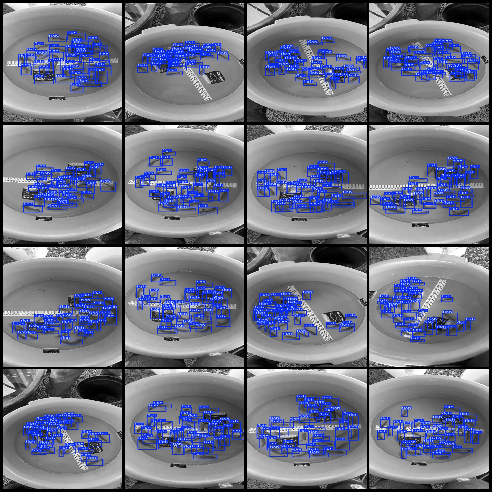
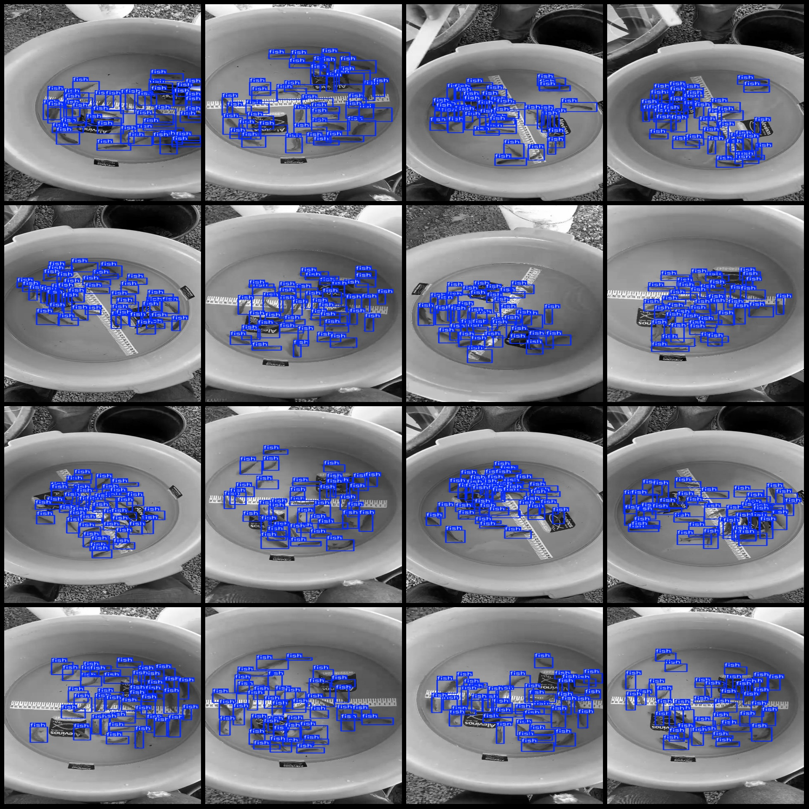

# Fish Cluster Counting Detection Data Set VOC+YOLO Format 1806 Images 1 Category

The dataset format: Pascal VOC format + YOLO format (the txt file does not contain the split path, it only contains the jpg images and the corresponding VOC format xml files and yolo format txt files).
The number of images (the number of jpg files): 1806.
annotation count: 1806  
annotation count: 1806  
annotationnumber of classes: 1  
The category name is "fish".
The number of bounding boxes in each category:
The number of fish in the frame is 72196.
total boxes: 72196  
images per class:   
fish images = 1806  
image resolution: 480x848  
Use annotation tool: labelImg
Annotation rules: draw a rectangle box around the class.
important notes: Dataset does not have separate train validation test sets. Please partition them yourself.
Special Notice: This dataset does not guarantee the accuracy of the trained model or weight files.
Preview image:
## Images

Here is a pay link on Stripe ( https://buy.stripe.com/3cs8yP7sY87d0vu9AB ). Please contact me lonlonago@foxmail.com after funding $89, and I will send you a complete data files , thank you!

